# BTG Funds Management App

Aplicación Flutter para la gestión de **Fondos de Pensiones Voluntarias (FPV)** y **Fondos de Inversión Colectiva (FIC)**.

La aplicación permite visualizar fondos disponibles, suscribirse a ellos, cancelar participaciones y consultar el historial de transacciones.

El proyecto fue desarrollado aplicando:

- Clean Architecture
- Bloc para manejo de estado
- GoRouter para navegación declarativa
- Material 3 para diseño de interfaz
- Material Theme Builder para generación del tema

---

# Tabla de contenidos

[Demo](#demo)

[Objetivo](#objetivo)

[Introduction](#arquitectura)

[Arquitectura](#arquitectura)

[Dominio](#dominio)

[Navegación](#navegación)

[UI y Diseño](#ui-y-diseño)

[Dashboard](#dashboard)

[Fuente de datos](#fuente-de-datos)

[Testing](#testing)

[Instalación](#instalación)

[Escalabilidad](#escalabilidad)

[Decisiones técnicas](#decisiones-t--cnicas)

[Screenshots](#screenshots)

---
#Demo

Saldo inicial del usuario:

```
COP $500.000
```

El usuario puede:

invertir en fondos

cancelar participaciones

consultar historial

visualizar estadísticas del portafolio
---

# Objetivo

Construir una aplicación web/mobile que permita a un usuario:

- visualizar fondos disponibles
- suscribirse a un fondo si cumple el monto mínimo
- cancelar participaciones
- consultar historial de transacciones
- seleccionar método de notificación (Email o SMS)

Saldo inicial del usuario:

```COP $500.000```

---

# Arquitectura

El proyecto sigue **Clean Architecture basada en features**.
```
lib
│
├── core
│ ├── di
│ ├── errors
│ ├── network
│ ├── router
│ └── theme
│
├── shared
│ └── widgets
│
└── features
└── funds
├── data
│ ├── datasources
│ ├── models
│ └── repositories
│
├── domain
│ ├── entities
│ ├── repositories
│ └── usecases
│
└── presentation
├── bloc
├── pages
└── widgets
```

---

# Diagrama de arquitectura

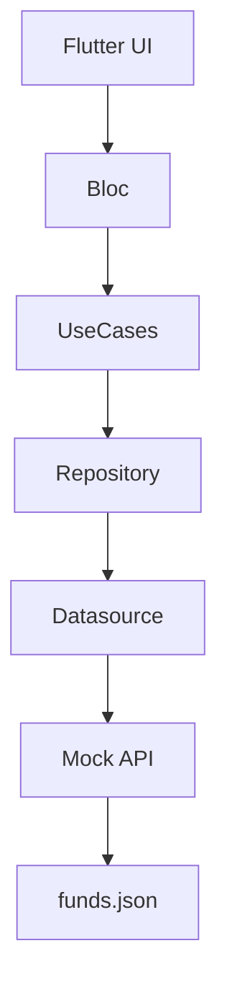
---

## Modelo del dominio

El dominio principal es el portafolio del usuario.
```
FundAggregate
   ├ funds
   ├ transactions
   └ balance
```
Este agregado representa el estado completo de inversión del usuario.


# Flujo funcional

## Suscripción a fondo

flowchart LR

User[Usuario]
Home[Dashboard]
Subscribe[Suscribirse]
Validate[Validaciones]
Register[Registrar transacción]

User --> Home
Home --> Subscribe
Subscribe --> Validate
Validate --> Register
Register --> Home

Validaciones realizadas:

monto mínimo del fondo

saldo disponible

suscripción duplicada

## Cancelación de suscripción

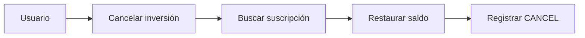
---

# Navegación

La aplicación utiliza GoRouter para navegación declarativa.

#### Rutas principales:
```
/
├── /subscribe
├── /cancel
└── /history
```
---

#### Esto permite:

navegación declarativa

deep linking

estructura de rutas centralizada

---

# UI y Diseño

La interfaz utiliza Material 3 y un tema personalizado definido en ```theme.dart```.

El tema implementa:

- ColorScheme completo

- Soporte para modo claro y oscuro

- Esquemas de alto contraste

- Colores extendidos para inversión

El tema incluye:
```
Light Theme
Dark Theme
Medium Contrast
High Contrast 
```

## Extended Colors

### Paleta de colores
```
Primary        Azul institucional
Surface        Neutro financiero
CustomColor    Verde inversión
```
## Significado:
```
Azul → confianza institucional
Verde → crecimiento financiero
Superficies neutras → legibilidad
```

---
# Dashboard

El dashboard muestra información clave del portafolio del usuario.

```
* Saldo disponible
* Estadísticas rápidas
* Fondos disponibles
```

Ejemplo:
```
┌─────────────────────────────┐
│        BTG Funds            │
├─────────────────────────────┤
│ Saldo disponible            │
│ COP 500.000                 │
├─────────────────────────────┤
│   Invertido | Fondos        │
├─────────────────────────────┤
│ Fondos disponibles          │
│ FPV Conservador             │
│ FPV Moderado                │
└─────────────────────────────┘
```
---

## Estadísticas rápidas

El dashboard calcula dinámicamente:

```
Monto invertido
Fondos activos
```

## Tarjetas de fondos

Cada fondo se presenta en una FundCard que incluye:

- Nombre del fondo

- Monto mínimo requerido

- Acción para invertir

Las tarjetas usan el ColorScheme de Material 3 para mantener consistencia visual.

## Soporte de tema (Dark / Light)

La aplicación incluye un toggle de tema en el AppBar.

Características:

- Cambio dinámico entre modo claro y oscuro

- Integración con Material 3

- Estado reactivo global

Esto se implementa mediante un ``ValueNotifier`` global compatible con GoRouter.

# Fuente de datos

La aplicación usa una API simulada.

Archivo:
``
assets/data/funds.json
``

Ejemplo:
```json
{
  "funds": [
    {
      "id": 1,
      "name": "FPV Conservador",
      "minAmount": 75000
    }
  ]
}
```

La simulación se implementa usando Dio Mock Adapter.

# Manejo de estado

Se usa Bloc Pattern.

Eventos principales:
```
LoadFunds
SubscribeFundEvent
CancelFundEvent
```

## Estados manejados:
```
loading
error
portfolio
```

## Manejo de errores

El proyecto implementa una capa de errores desacoplada.
```
Exception
   │
Failure
   │
FailureMapper
   │
UI Message
```
Esto permite convertir errores técnicos en mensajes amigables para el usuario.

## Dependency Injection

Se utiliza GetIt para registrar dependencias.

Los módulos están organizados por responsabilidad.
```
core/di/modules
 ├ network_module.dart
 ├ core_module.dart
 └ funds_module.dart
```
 # Testing

El proyecto incluye diferentes niveles de pruebas.

## Unit Tests

Cubren reglas de negocio del Bloc:

- Suscripción válida

- Cancelación

- Validación de saldo

- Validación de monto mínimo

## Widget Tests

Pantallas cubiertas:
```
HomePage
SubscribePage
CancelSubscriptionPage
HistoryPage
FundCard
```
Estos tests verifican:

- Renderizado correcto

- Validaciones de formulario

- Interacción de usuario

# Instalación

## Clonar repositorio:

git clone ```<repository-url>```

## Instalar dependencias:

```
flutter pub get
```
## Ejecutar:
```
flutter run  flutter run -d chrome
```
## Ejecutar tests:
```
flutter test flutter test--coverage
```
---

# Screenshots
## Dashboard
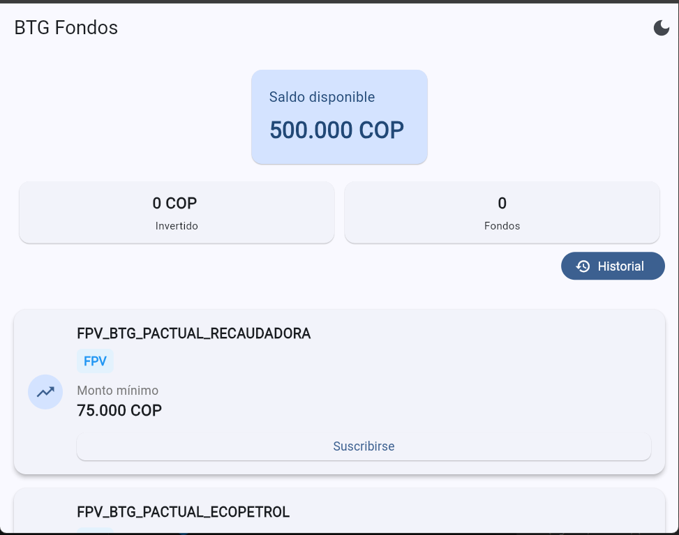
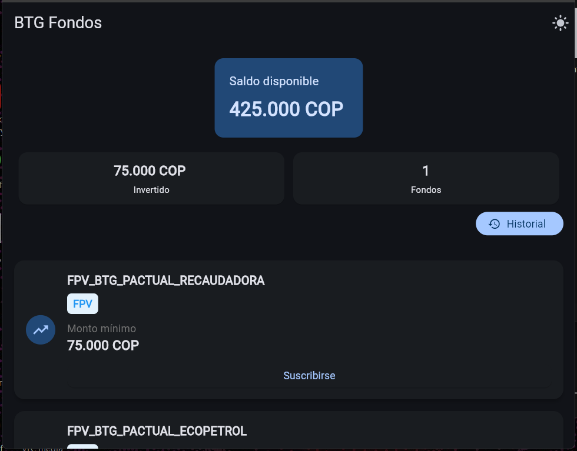

## Suscripción
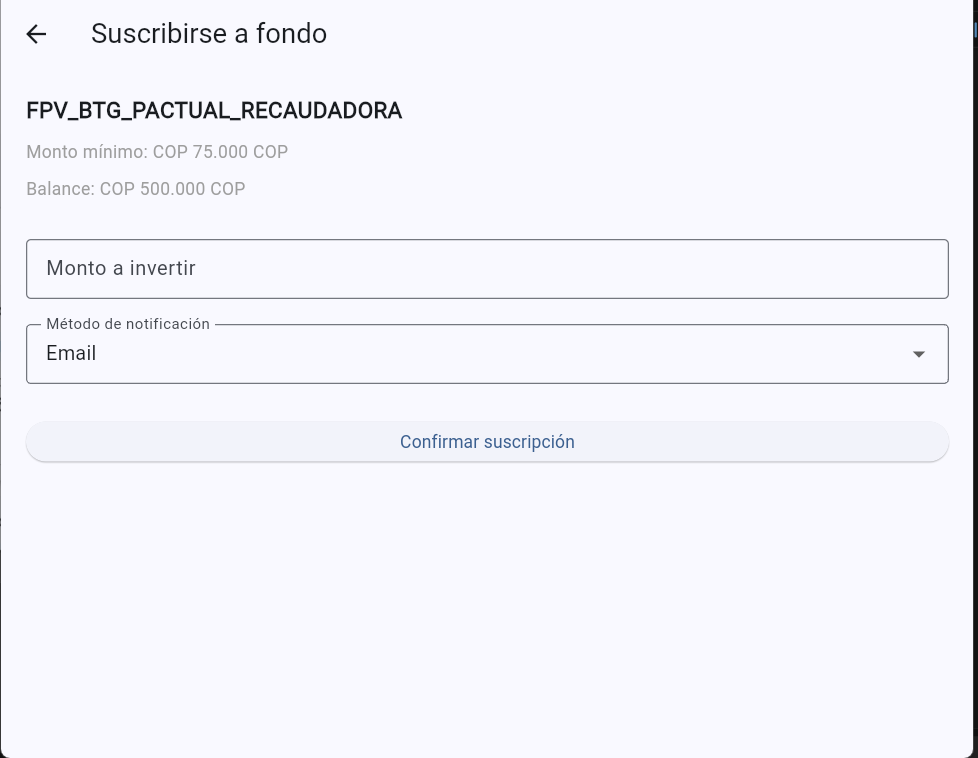
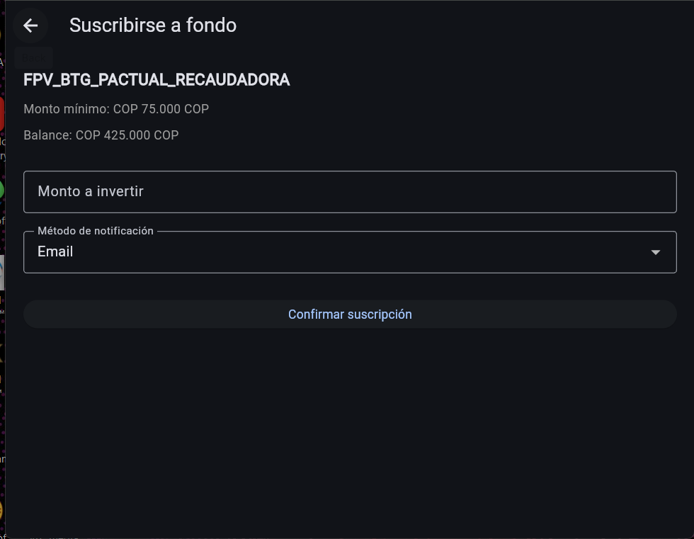

## Historial
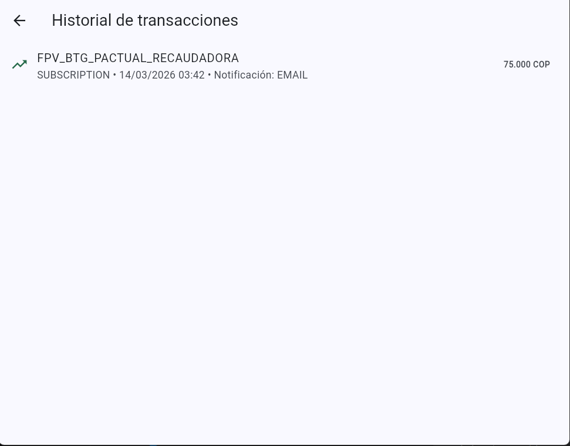
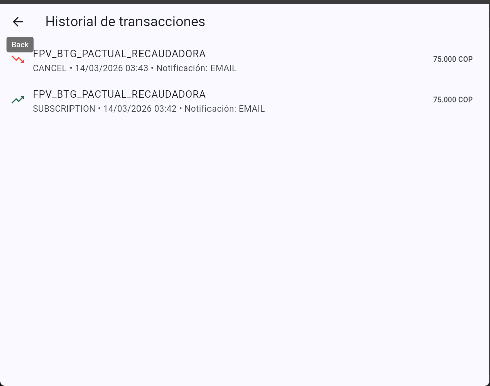
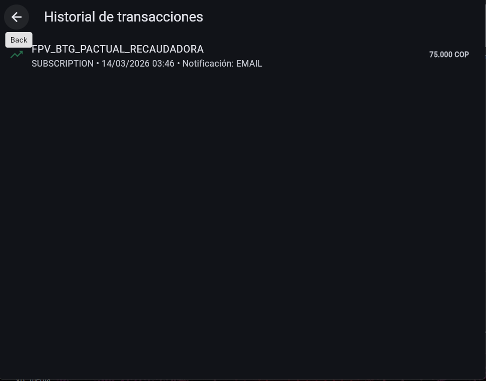

## Cancelar
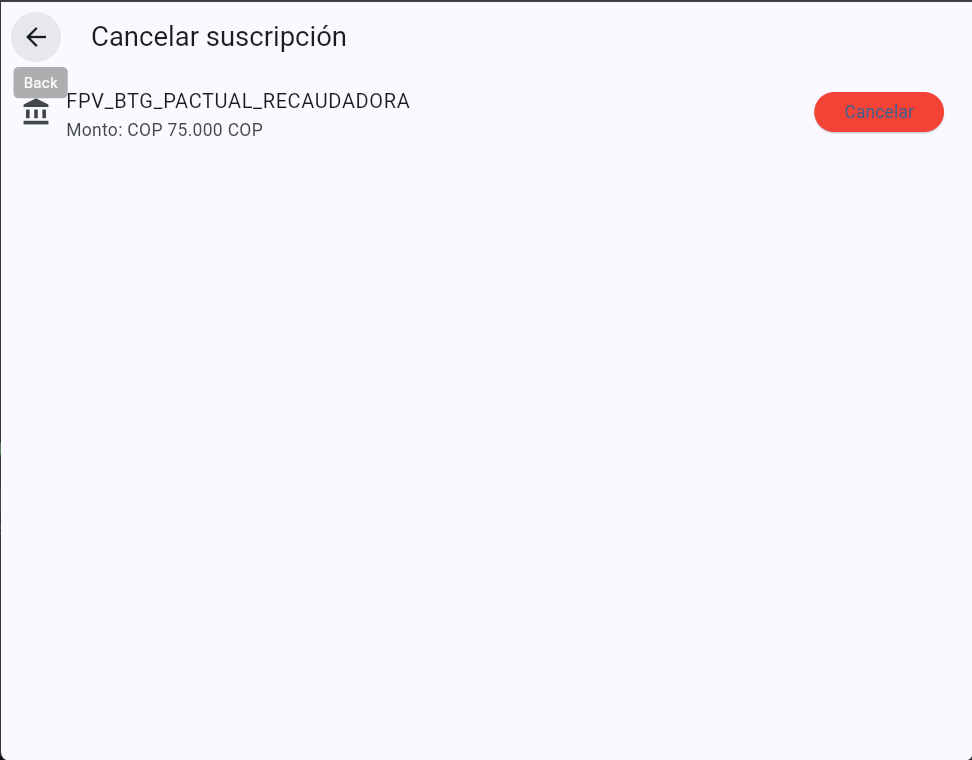
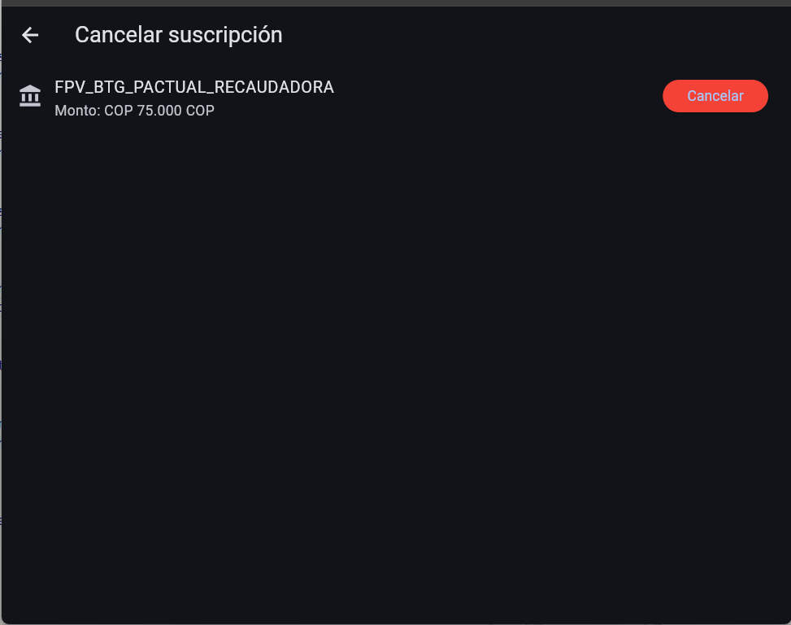

## Error
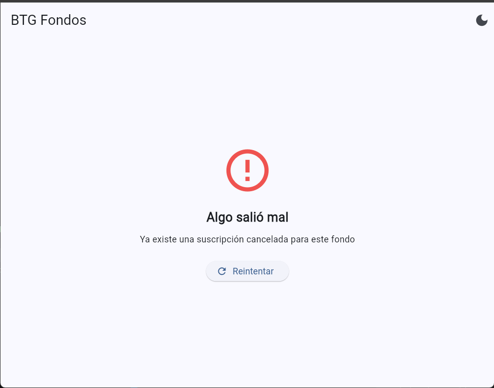
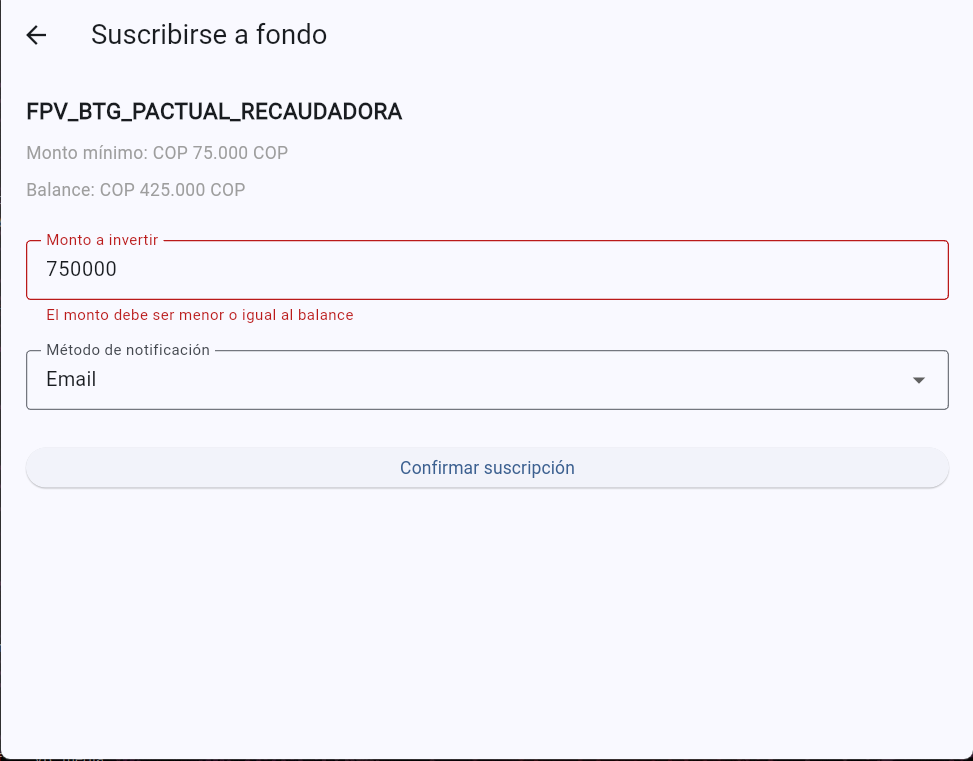

## Success
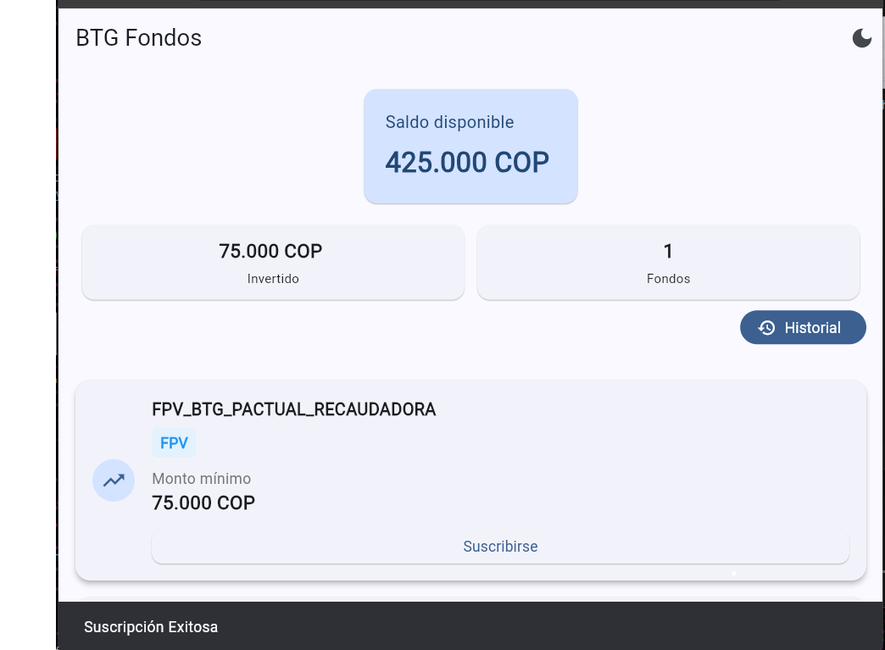
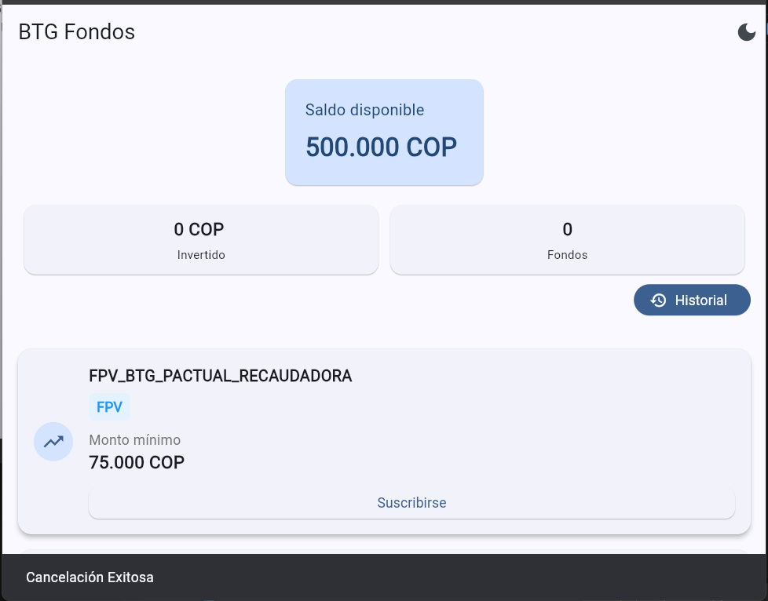

---

# Escalabilidad

La arquitectura permite extender el proyecto fácilmente.

Ejemplos de futuras features:
```
Autenticación de usuario
Integración con backend real
Notificaciones push
Analytics de inversión
Persistencia local
```
---
# Decisiones técnicas
### Clean Architecture

Permite desacoplar la lógica de negocio de la infraestructura.

### Bloc

Elegido por su claridad en el manejo de eventos y estados.

### GoRouter

Permite navegación declarativa y estructura clara de rutas.

### Material 3

Permite construir interfaces modernas y consistentes.

### API simulada

El ejercicio no requería backend, por lo que se utilizó un mock basado en JSON.

---
# Posibles mejoras futuras

- Integración con backend real

- Persistencia local

- Soporte offline

- Dashboard financiero avanzado

- Gráficos de inversión

- Personalización de portafolio
---
# Autor

Proyecto desarrollado como ejercicio técnico demostrando:

- Arquitectura escalable

- Buenas prácticas Flutter

- Testing

- Diseño Material 3

